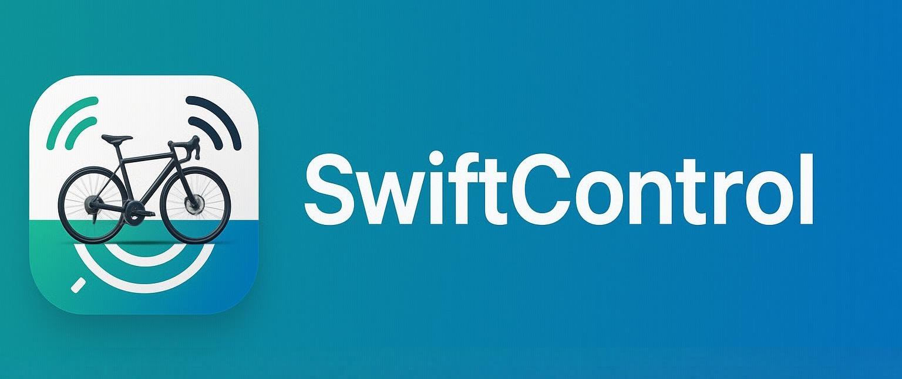

# SwiftControl

## Description

With SwiftControl you can control your favorite trainer app using your Zwift Click, Zwift Ride or Zwift Play devices. Primarily useful to perform virtual gear shifting.

https://github.com/user-attachments/assets/1f81b674-1628-4763-ad66-5f3ed7a3f159

## Downloads
Get the latest version here: https://github.com/jonasbark/swiftcontrol/releases

## Supported Apps
- MyWhoosh
- indieVelo / Training Peaks
- any other: 
  - Android: you can customize the gear shifting touch points in the app
  - Desktop: you can customize the keyboard shortcuts in the app

## Supported Devices
- Zwift Click
- Zwift Ride
- Zwift Play

## Supported Platforms
- Android
- macOS
- Windows (make sure you have installed the "[Microsoft Visual C++ Runtime libraries](https://learn.microsoft.com/en-us/cpp/windows/latest-supported-vc-redist?view=msvc-170)")
- [Web](https://jonasbark.github.io/swiftcontrol/) (you won't be able to do much)

## Troubleshooting
Your Zwift device is found but connection does not work properly? You may need to update the firmware in Zwift Companion app.

## How does it work?
The app connects to your Zwift device automatically. 

- When using Android a "click" on a certain part of the screen is simulated to trigger the action.
- When using macOS or Windows a keyboard click is used to trigger the action. Typically + and - keys are used to shift gears, while MyWhoosh uses K and I keys.

## Donate
Please consider donating to support the development of this app. 

## TODO
- implement more actions for Play + Ride
